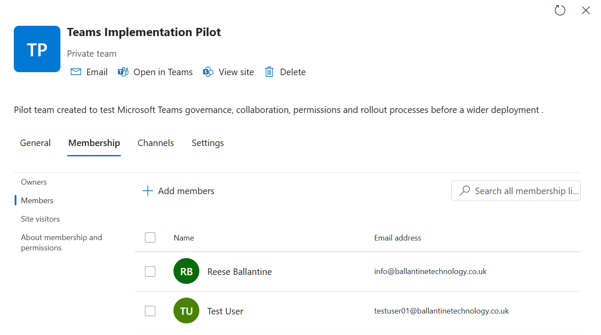
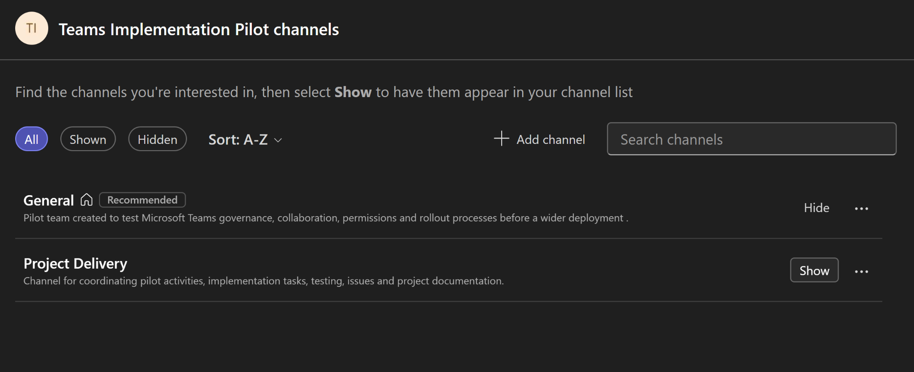
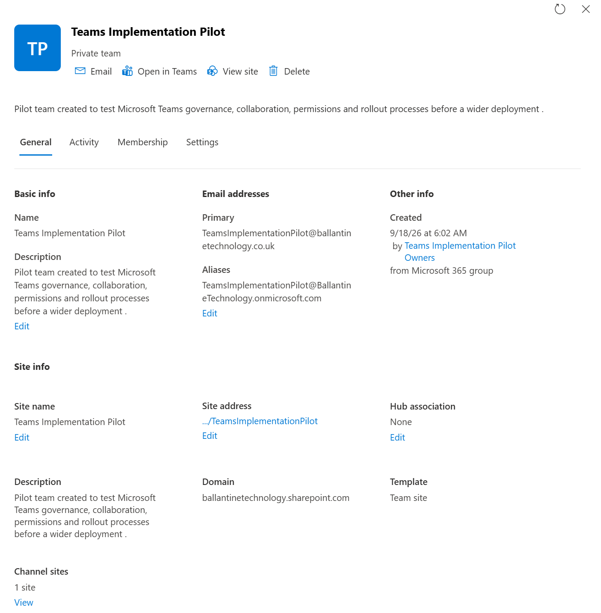
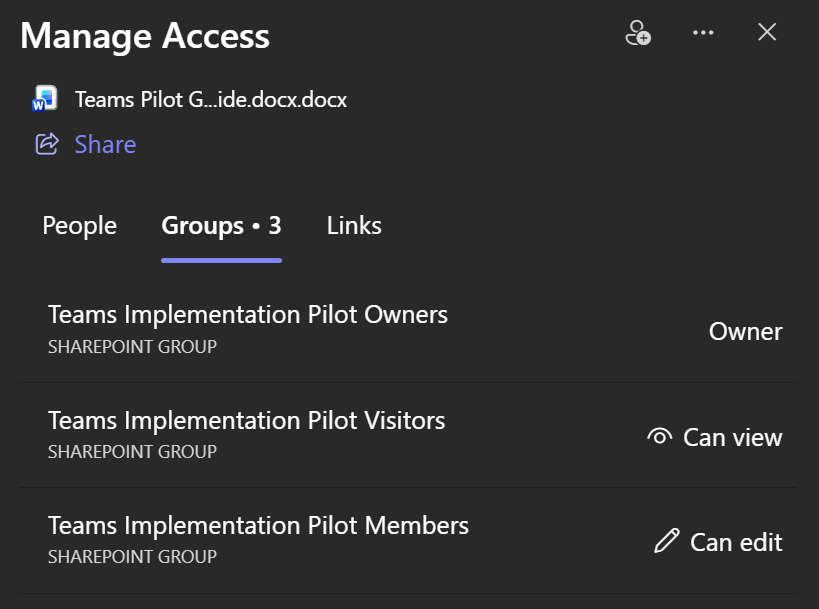
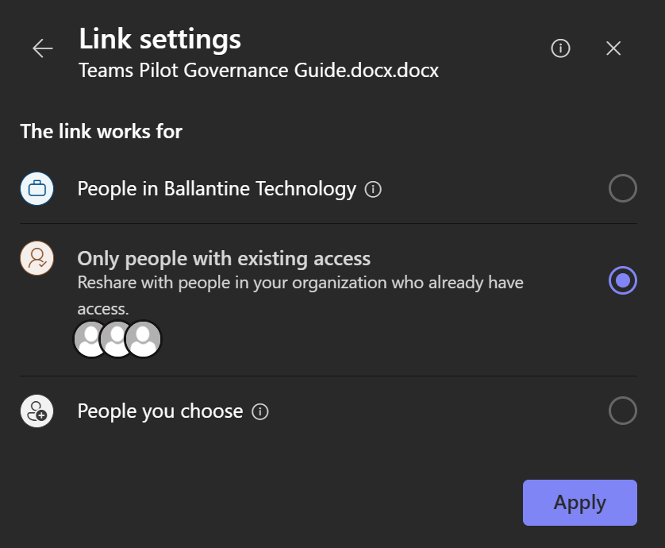
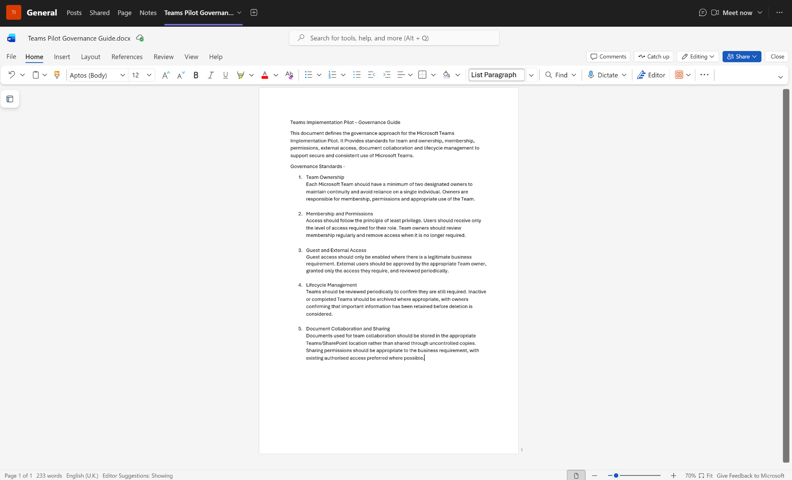
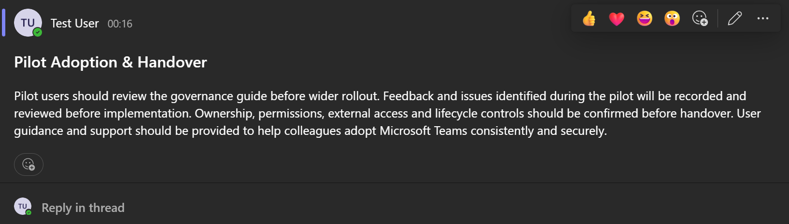
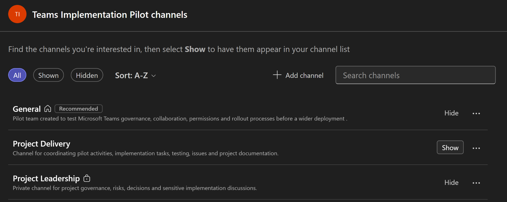

# Project Evidence

This folder contains selected screenshots from the Microsoft Teams Governance & Implementation Pilot.

The evidence demonstrates practical configuration and testing across:

- Microsoft Teams governance and administration
- Team, owner and member management
- Standard and private channel configuration
- SharePoint Online integration
- Permissions and access control
- External file-sharing controls
- Messaging and collaboration features
- Governance documentation
- User testing, adoption and handover planning

Screenshots have been selected to demonstrate key project outcomes rather than every individual action performed during the pilot.

> This project was completed as a self-directed Microsoft 365 technical lab and was not a production deployment for an external organisation.

## Evidence Index

### Team & Channel Structure

#### Pilot Team Created
Shows the Microsoft Teams Implementation Pilot created as the controlled environment for governance and collaboration testing.

#### Standard Project Channel
Shows the Project Delivery standard channel used to coordinate implementation activities, testing, issues and project documentation.

#### Private Leadership Channel
Shows the Project Leadership private channel created for governance, risks, decisions and sensitive project discussions.

---

### Membership & Access Control

#### Pilot Team Membership Review
Demonstrates review of pilot Team membership as part of access and ownership governance.

#### Private Channel Access Verification
Demonstrates validation of access to the private Project Leadership channel.

---

### SharePoint & Permissions

#### SharePoint Pilot Site
Shows the SharePoint Online team site associated with the Microsoft Teams pilot, demonstrating the relationship between Teams and SharePoint.

#### SharePoint Group Permissions
Shows the SharePoint permission model using Owners, Members and Visitors groups with different access levels.

#### Restricted Sharing Link
Demonstrates testing of the "People with existing access" sharing option to avoid unnecessarily granting additional access.

---

### Governance & Adoption

#### Governance Standards
Shows documented governance standards covering ownership, membership, permissions, external access and lifecycle management.

#### Adoption & Handover
Shows the pilot adoption and handover approach, including user guidance, feedback, governance review and preparation for wider rollout.

#### Private Channel Access Control
Shows the completed channel structure, including the private Project Leadership channel used to separate sensitive project governance activity.

---

## Evidence Summary

The evidence demonstrates practical experience across:

- Microsoft Teams configuration and administration
- Standard and private channel governance
- Microsoft 365 group membership
- SharePoint Online integration
- Permission and access-control validation
- External sharing controls
- Least-privilege sharing
- Governance documentation
- User testing
- Adoption and handover planning

The screenshots represent selected evidence from a wider set of tests completed during the pilot.

> This was a self-directed Microsoft 365 governance pilot and not a production deployment for an external organisation.
